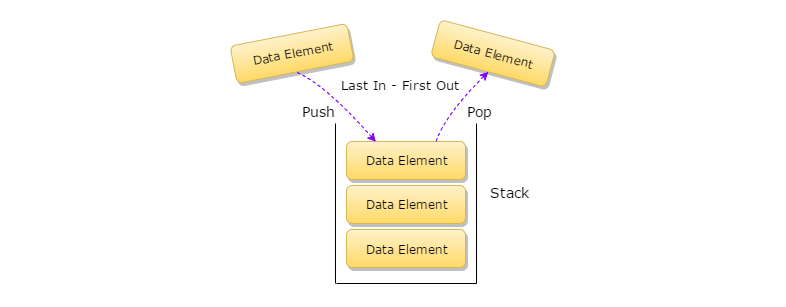

<h1 align="center">Stacks</h1>

- A stack is a crucial linear data structure that follows the Last In First Out (LIFO) principle. This means that the last element added to the stack will be the first one to be removed.



> Stacks Key Points and Features:

- Stacks are used to store data in a sequential manner.
- Stacks are dynamic in nature; this means that they do not have a fixed size and their size can be increased or decreased depending upon the number of elements.
- In stacks, only one end is available to perform actions like insertion or deletion of the elements
- Stacks follow LIFO, which is Last In, First Out mechanism. Inserting an element is known as push, and deleting an element is known as pop.
- Stacks are used in various applications like function calls, expression evaluation, etc.

> Stacks Operations:

- **Push**: Adds an element to the stack.
  - Complexity: O(1)
- **Pop**: Removes an element from the stack.
  - Complexity: O(1)
- **Peek**: Returns the top element of the stack.
  - Complexity: O(1)
- **isEmpty**: Checks if the stack is empty.
  - Complexity: O(1)
- **isFull**: Checks if the stack is full.
  - Complexity: O(1)
- **Size**: Returns the size of the stack.

>Example Question:


```
Given a string s containing just the characters '(', ')', '{', '}', '[' and ']', determine if the input string is valid.

An input string is valid if:

Open brackets must be closed by the same type of brackets.
Open brackets must be closed in the correct order.
Every close bracket has a corresponding open bracket of the same type.

```	

> Solution using a stack:

```python
def isValid(s: str) -> bool:
    stack = [] # Initialize a stack
    mapping = {")": "(", "}": "{", "]": "["} # Mapping of closing and opening brackets
    for char in s: # Iterate through the string
        if char in mapping: #if the character is inside our mapping
            if stack: #if the stack is not empty
                top_element = stack.pop() #pop the top element
            else:
                top_element = "#" #if the stack is empty, assign a dummy value
            if mapping[char] != top_element:
                return False
        else:
            stack.append(char)
    return not stack
```

