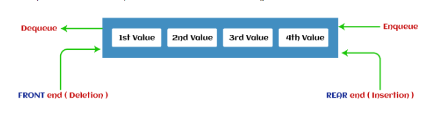

<h1 align="center">Queues</h1>

- A queue is a linear data structure that follows the First In First Out (FIFO) principle. This means that the first element added to the queue will be the first one to be removed.
- Queues are also used to store data in a sequential manner.

 

> Queues Key Points and Features:

- Queues are dynamic in nature; this means that they do not have a fixed size and their size can be increased or decreased depending upon the number of elements.
- In queues, two ends are available to perform actions like insertion or deletion of the elements.
- Queues follow FIFO, which is First In, First Out mechanism. Inserting an element is known as enqueue, and deleting an element is known as dequeue.
- Queues are used in various applications like CPU scheduling, Disk Scheduling, etc.

 

> Types of Queues

- ### **Simple Queue/Linear Queue:**
  - In Linear Queue, an insertion takes place from one end while the deletion occurs from another end. The end at which the insertion takes place is known as the rear end, and the end at which the deletion takes place is known as front end. It strictly follows the FIFO rule.
  

- ### **Circular Queue:**
    - In Circular Queue, the last element is connected to the first element to form a circle. It is also known as Ring Buffer. It is used to avoid wastage of space in a simple queue.
  

- ### **Priority Queue:**
  - It is a special type of queue in which the elements are arranged based on the priority. It is a special type of queue data structure in which every element has a priority associated with it. Suppose some elements occur with the same priority, they will be arranged according to the FIFO principle. The representation of priority queue is shown in the below image.

- ### **Deque:**
  - In Deque or Double Ended Queue, insertion and deletion can be done from both ends of the queue either from the front or rear. It means that we can insert and delete elements from both front and rear ends of the queue. Deque can be used as a palindrome checker means that if we read the string from both ends, then the string would be the same.

 

> Queues Operations:

- **Enqueue**: Adds an element to the queue.
  - Complexity: O(1)
- **Dequeue**: Removes an element from the queue.
  - Complexity: O(1)
- **Peek**: Returns the front element of the queue.
  - Complexity: O(1)
- **isEmpty**: Checks if the queue is empty.
  - Complexity: O(1)
- **isFull**: Checks if the queue is full.
  - Complexity: O(1)

> Example Question:

<a href="https://leetcode.com/problems/design-circular-queue/description/">Design Circular Queue</a>