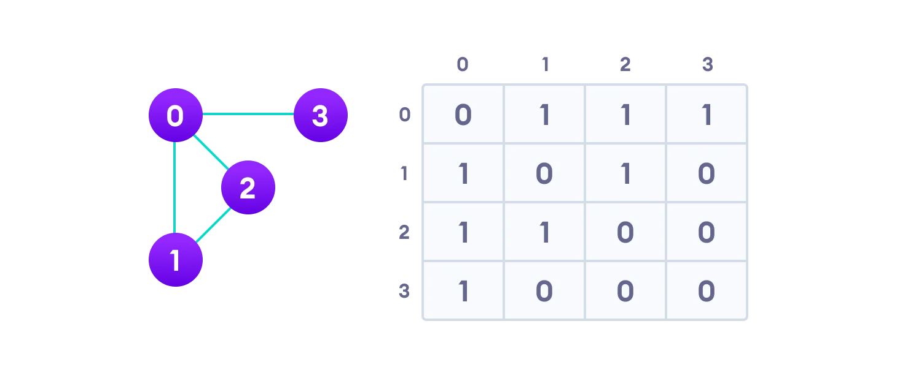
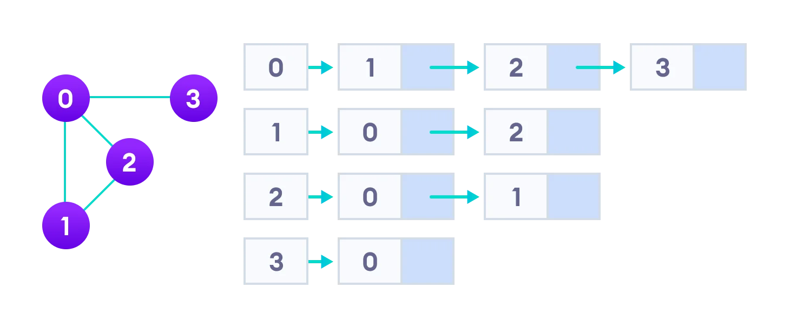

<h1 align="center">Graphs</h1>

A graph data structure is a collection of nodes that have data and are connected to other nodes.

More precisely, a graph is a data structure (V, E) that consists of

- A collection of vertices V
- A collection of edges E, represented as ordered pairs of vertices (u,v)
a graph contains vertices that are like points and edges that connect the points
Vertices and edges
In the graph,


```python
V = {0, 1, 2, 3}
E = {(0,1), (0,2), (0,3), (1,2)}
G = {V, E}
```

<h2>Graph Terminology</h2>

- Adjacency: A vertex is said to be adjacent to another vertex if there is an edge connecting them. Vertices 2 and 3 are not adjacent because there is no edge between them.
- Path: A sequence of edges that allows you to go from vertex A to vertex B is called a path. 0-1, 1-2 and 0-2 are paths from vertex 0 to vertex 2.
- Directed Graph: A graph in which an edge (u,v) doesn't necessarily mean that there is an edge (v, u) as well. The edges in such a graph are represented by arrows to show the direction of the edge.

<h2>Graph Representation</h2>
Graphs are commonly represented in two ways:

1. **Adjacency Matrix**

An adjacency matrix is a 2D array of V x V vertices. Each row and column represent a vertex.

If the value of any element a[i][j] is 1, it represents that there is an edge connecting vertex i and vertex j.

The adjacency matrix for the graph we created above is



graph adjacency matrix for sample graph shows that the value of matrix element is 1 for the row and column that have an edge and 0 for row and column that don't have an edge
Graph adjacency matrix
Since it is an undirected graph, for edge (0,2), we also need to mark edge (2,0); making the adjacency matrix symmetric about the diagonal.

Edge lookup(checking if an edge exists between vertex A and vertex B) is extremely fast in adjacency matrix representation but we have to reserve space for every possible link between all vertices(V x V), so it requires more space.

2. **Adjacency List**

An adjacency list represents a graph as an array of linked lists.

The index of the array represents a vertex and each element in its linked list represents the other vertices that form an edge with the vertex.

The adjacency list for the graph we made in the first example is as follows:




adjacency list representation represents graph as array of linked lists where index represents the vertex and each element in linked list represents the edges connected to that vertex
Adjacency list representation
An adjacency list is efficient in terms of storage because we only need to store the values for the edges. For a graph with millions of vertices, this can mean a lot of saved space.

<h2>Common graphs operations</h2>

- **Add Vertex**: Adds a new vertex to the graph.
- **Add Edge**: Adds a new edge between two vertices in the graph.
- **Remove Vertex**: Removes a vertex from the graph.
- **Remove Edge**: Removes an edge between two vertices in the graph.
- **Contains**: Checks whether a vertex is present in the graph.
- **Get Neighbors**: Returns a list of all the vertices that are connected to a given vertex.
- **Get Vertex**: Returns the vertex if it is present in the graph.

<h2>Common Types of Graphs</h2>

1. **Undirected Graphs**: A graph in which an edge (u,v) doesn't imply that there is an edge (v, u) as well. The edges are bi-directional.

2. **Directed Graphs**: A graph in which an edge (u,v) does not imply that there is an edge (v, u). The edges are uni-directional.

3. **Weighted Graphs**: A graph with numbers assigned to its edges. These numbers are called weights.

4. **Unweighted Graphs**: A graph with no weights assigned to its edges.

5. **Cyclic Graphs**: A graph that has at least one cycle. A cycle is defined as a path of at least length 3 that starts and ends at the same vertex.

6. **Acyclic Graphs**: A graph that has no cycles.

<h2>Applications of Graphs</h2>

Graphs are used to represent networks. The networks may include paths in a city or telephone network or circuit network. Graphs are also used in social networks like linkedIn, Facebook. For example, in Facebook, each person is represented with a vertex(or node). Each node is a structure and contains information like person id, name and a pointer to the linked list of friends. 

<h2>Graph Traversal</h2>

- **Breadth First Search (BFS)**: BFS is a traversing algorithm where you should start traversing from a selected node (source or starting node) and traverse the graph layerwise thus exploring the neighbour nodes (nodes which are directly connected to source node). You must then move towards the next-level neighbour nodes.

- **Depth First Search (DFS)**: DFS is an algorithm for traversing or searching tree or graph data structures. The algorithm starts at the root node (selecting some arbitrary node as the root node in the case of a graph) and explores as far as possible along each branch before backtracking.
