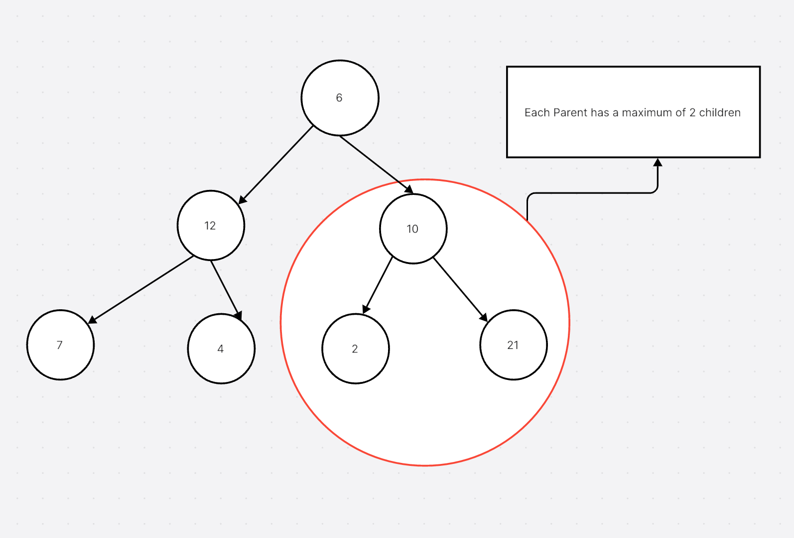

<h1 align="center">Binary Trees</h1>

- Binary Trees are types of trees in which each node has at most two children.
- The two children are referred to as the left child and the right child.

## Types of Binary Trees:
> (According to the height of the tree)

1. **Full Binary Tree**:
- A binary tree in which each node has either 0 or 2 children.
- A full binary tree is also known as a proper binary tree or 2-tree.

2. **Complete Binary Tree**:
- A binary tree in which all levels are completely filled except possibly for the last level.
- The last level is filled from left to right.

3. **Perfect Binary Tree**:
- A binary tree in which all internal nodes have exactly two children and all leaf nodes are at the same level.

4. **Balanced Binary Tree**:
- A binary tree in which the depth of the left and right subtrees of every node differ by at most 1.
5. **Skewed Binary Tree**:
- A binary tree in which all the nodes have only one child.

5. **Degenerate (or pathological) Tree**:
- A tree in which each parent node has only one associated child node.

## Operations on Binary Trees:
1. **Insertion**:
- Insert an element into the binary tree.

2. **Deletion**:
- Delete an element from the binary tree.

3. **Traversal**:
- Visit all the nodes in the binary tree.

4. **Searching**:
- Search for an element in the binary tree.