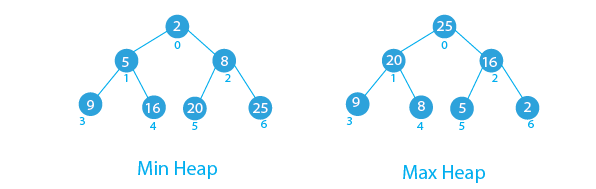

<h1 align="center">Heaps</h1>

A Heap is a complete binary tree data structure that satisfies the heap property: for every node, the value of its children is less than or equal to its own value or alternatively we can have the value of the Node is greater than or equal to it's parent.

Heap Data Structure

<h2>Types of heaps</h2>

- Max Heap: The root node contains the maximum value, and the values decrease as you move down the tree.
- Min Heap: The root node contains the minimum value, and the values increase as you move down the tree.

<h2>Heap Applications</h2>

- Heaps are commonly used to implement priority queues, where elements are retrieved based on their priority (maximum or minimum value).
- Heapsort is a sorting algorithm that uses a heap to sort an array in ascending or descending order.
- Heaps are used in graph algorithms like Dijkstra’s algorithm and Prim’s algorithm for finding the shortest paths and minimum spanning trees.
