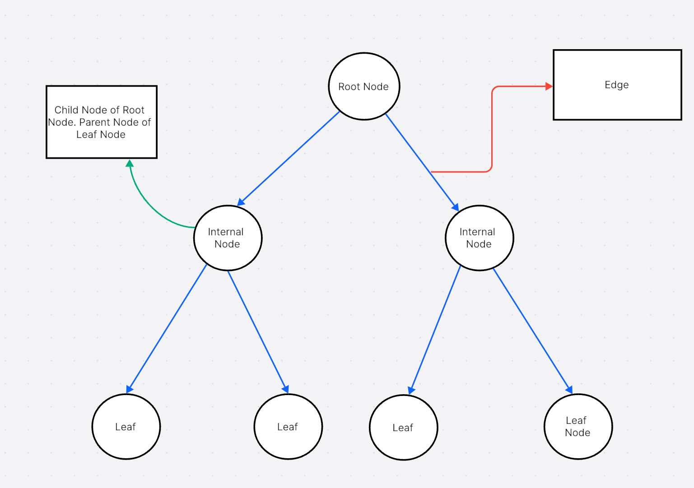

<h1 align="center">TREES</h1>

- Trees are an example of non-linear data structures where each element is connected to more than two adjacent elements creating a hierarchical structure. 
- Trees comprise of nodes whereby a node basically comprises of a data element and a reference to the next node (either the left or right pointer). 

## Terminologies in Trees:

1. **Root Node**: The topmost node in a tree.
2. **Parent Node**: A node that has child nodes.
3. **Child Node**: A node that has a parent node.
4. **Leaf Node**: A node that does not have any child nodes.
5. **Siblings**: Nodes that share the same parent node.
6. **Ancestor**: A node that is on the path from the root node to a given node.
7. **Descendant**: A node that is on the path from a given node to a leaf node.
8. **Depth of a Node**: The number of edges from the root node to the given node.
9. **Height of a Node**: The number of edges on the longest path from the given node to a leaf node.
10. **Height of a Tree**: The height of the root node.*

## Types of Trees:
> (According to the number of children each node can have)

1. **Binary Trees**: 
-  A tree in which each node has at most two children.
<a href="./BinaryTrees/README.md">See content on Binary Trees</a>

2. **Ternary Trees**: 
- A tree in which each node has at most three children.
<a href="./TernaryTrees/README.md">See content on Ternary Trees</a>

3. **Generic Trees**: 
- A tree in which each node can have any number of children.
<a href="./GenericTrees/README.md">See content on Generic Trees</a>

## Applications of Trees
